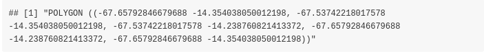
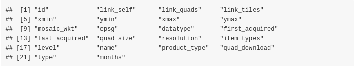
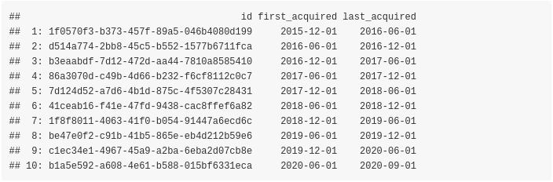
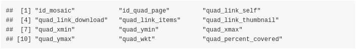
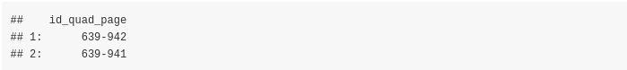
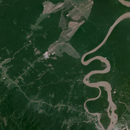
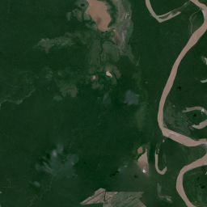
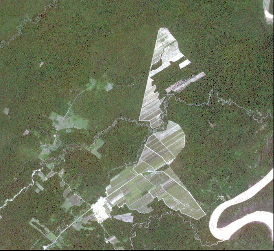
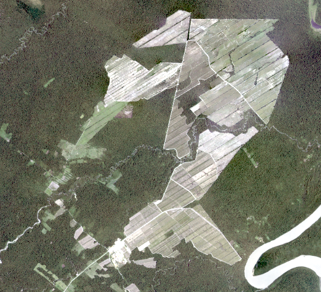
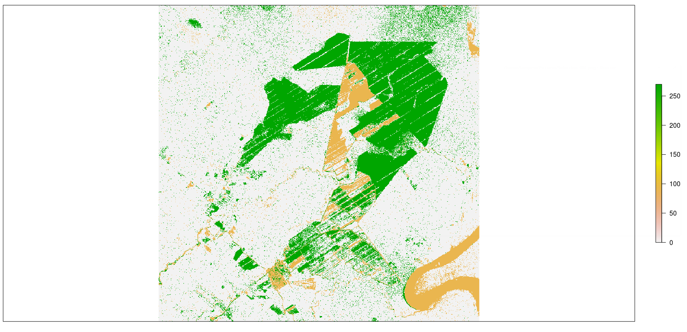

```{r, include = FALSE}
knitr::opts_chunk$set(fig.width = 6,
                      fig.height = 6, 
                      fig.align = "center",
                      warning = FALSE, 
                      message = FALSE,
                      echo = TRUE,
                      eval = FALSE)
```


This vignette shows the functionality of the [PlanetNICFI](https://CRAN.R-project.org/package=PlanetNICFI) R package based on a *change detection* use case. The official website of [NICFI](https://www.nicfi.no/) (Norway's International Climate and Forest Initiative) includes all the details about the initiative against global deforestation. This initiative was also covered extensively on the web especially from the [provider of the free Satellite Imagery](https://www.planet.com/pulse/universal-access-to-satellite-monitoring-paves-the-way-to-protect-the-worlds-tropical-forests/). Users have the opportunity to download high-resolution imagery of forests globally using a [simple sign up form](https://www.planet.com/nicfi/).

To take advantage of the **PlanetNICFI** R package you will need also an **API key** which you can receive once you are registered. For more details see the [Getting Started with Planet APIs](https://developers.planet.com/quickstart/apis/) website. 
<br>

The **Documentation** of the R package includes details on how to download and process **monthly** data for an Area of Interest (AOI), however, in this vignette I'll use **bi-annual** data because they are available since **2015** whereas **monthly** data is available since **September 2020**.

<br>

### Change Detection (using bi-annual Imagery)

<br>

To spot deforestation areas we will perform change detection based on a **Sugarcane cultivation area in Bolivia**. This use case is [not new](https://eros.usgs.gov/image-gallery/earthshot/deforestation) and there is also a small [YouTube video](https://www.youtube.com/watch?v=d1sq5M0vWwM) that shows the change of the area over time (**from 2016 to 2018**). For this change detection task we will use two images:

* the **first bi-annual** Image of **2016**
* the **first bi-annual** Image of **2018**

and the following Well Known Text (WKT) as a cropped area utilizing [geojson.io](http://geojson.io),

```{r}

wkt_file = system.file('data_files/Sugar_Cane_Bolivia.wkt', package = "PlanetNICFI")
WKT = readLines(wkt_file, warn = FALSE)
WKT

```



<br>

First, we have to create a variable and store the **API key** (which a user receives as explained previously),

```{r}

api_key = 'use_your_planet_nicfi_API_key_here'

```

<br>

Then we have to extract the **bi-annual mosaics** 

```{r}

require(PlanetNICFI)

mosaic_files = nicfi_mosaics(planet_api_key = api_key,
                             type = 'bi_annually',
                             crs_bbox = 4326,
                             URL = 'https://api.planet.com/basemaps/v1/mosaics',
                             verbose = FALSE)

dtbl = mosaic_files$dtbl_mosaic
colnames(dtbl)

```



<br>

The output of the **nicfi_mosaics** function is a named list of length 2 and we will keep the data.table (**dtbl_mosaic**) which includes the **mosaic id's** and the **bi-annual Dates** (among other columns) as the previous and the next output shows,


```{r}

cols_keep = c('id', 'first_acquired', 'last_acquired')
dtbl_keep = dtbl[, ..cols_keep]
dtbl_keep

```


<br>

Then we will extract the **mosaic Quads** of the images for years **2016** and **2018**. The [Planet Web API](https://developers.planet.com/docs/basemaps/reference/#tag/Basemaps-and-Mosaics) for the NICFI data includes both **Quads** ([pixel images of size 4096 x 4096](https://developers.planet.com/docs/data/sr-basemaps/)) and **tiles** ([pixel images of size 256 x 256](https://support.planet.com/hc/en-us/articles/360020018497-Planet-Tile-Streaming-FAQ)) for the global forest areas. 

The **PlanetNICFI** R package makes use of **Quads** because it allows the user to extract a specified Area of Interest (AOI) based on a **bounding box**, as I'll explain later in this vignette. 

In the previous subset **dtbl_keep** data.table we see that 

* the **first bi-annual** image of **2016** is in **row 1** (**2015-12-01 to 2016-06-01**) and 
* the **first bi-annual** image of **2018** is in **row 5** (**2017-12-01 to 2018-06-01**)

Therefore, we will first extract the first 10 pages for the Quads for the year 2016 (because a maximum of 10 pages is sufficient and will cover our AOI),

<br>

```{r}

index_year_2016 = 1
mosaic_ID_2016 = dtbl_keep$id[index_year_2016]

quad_files = nicfi_quads_bbox(planet_api_key = api_key,
                              mosaic_id = mosaic_ID_2016,
                              bbox_AOI = NULL,
                              wkt_AOI = WKT,
                              page_size = 10,
                              crs_bbox = 4326,
                              verbose = FALSE)

dtbl_quads = quad_files$quads
colnames(dtbl_quads)

```



<br>

In the same way as with the *mosaics*, the output of the **nicfi_quads_bbox** function is a named list (this time of length 3) and we will keep the data.table (**dtbl_quads**) which includes the **id_quad_page**, **quad_link_download** and the **quad_link_thumbnail** columns which are required for our analysis. 

<br>

```{r}

cols_keep_quads = c('id_quad_page', 'quad_link_download', 'quad_link_thumbnail')
dtbl_keep_quads = dtbl_quads[, ..cols_keep_quads]
dtbl_keep_quads[, 'id_quad_page']

```



Although we specified a maximum of 10 pages, as we see from the output, only 2 Quads are returned for our input bounding box. 

In first place we can download and visualize the **thumbnail .png** images of these 2 files, which are small in size. For this purpose we'll utilize the [aria2c](https://aria2.github.io/) download utility. For installation instructions of **aria2c** (on all 3 Operating Systems) have a look at the [README.md](https://github.com/mlampros/PlanetNICFI#aria2c) file of the **PlanetNICFI** R package. A nice feature of **aria2c** is that it allows paralleled download of files and it takes also various other parameters such as a **retry limit** or **maximum retries** (you can have a look at the [Documentation](https://aria2.github.io/manual/en/html/index.html) of *aria2c* for more information)

The **aria2c_download_paths** function of the R package allows the user to format the download web URL paths either of the **thumbnail png** or of the bigger **tif** files,

<br>

```{r}

url_paths_2016 = aria2c_download_paths(mosaic_output = mosaic_files,
                                       mosaic_id = mosaic_ID_2016,
                                       quads_output = quad_files,
                                       img_type = 'thumbnail')

url_paths_2016

```

<br>

and we have also to specify a temporary directory so that we can download all required files,

```{r}

temp_dir_out = tempdir()
temp_dir_out

```

<br>

We set the number of threads to run in parallel equal to the number of the downloaded files and adjust the *aria2c* parameters too (for a sequential download see the *'sequential_download_paths()'* function that doesn't make use of the *'aria2c'* software),


```{r}

all_threads = parallel::detectCores()
set_threads = length(url_paths_2016) / 2
num_threads = ifelse(set_threads < all_threads, set_threads, all_threads)
aria_args = '--allow-overwrite --file-allocation=none --retry-wait=5 --max-tries=0'

res_downl = aria2c_bulk_donwload(vector_or_file_path = url_paths_2016,
                                 default_directory = temp_dir_out,
                                 threads = num_threads,
                                 verbose = FALSE,
                                 secondary_args_aria = aria_args)

```
<br>

The following images correspond to the downloaded .png's of the **year 2016** and show the AOI in low resolution,

<br>

Image (a)             |  Image (b)      
:-------------------------:|:-------------------------:
 | 

<br>

We can now proceed to download the **.tif** files which are required for the change detection task. We slightly modify the **aria2c_download_paths** function by adjusting the **img_type** parameter to **'tif'**. The following code snippet downloads the .tif images of **year 2016**,

```{r}

url_paths_2016_tif = aria2c_download_paths(mosaic_output = mosaic_files,
                                           mosaic_id = mosaic_ID_2016,
                                           quads_output = quad_files,
                                           img_type = 'tif')

res_downl_tif = aria2c_bulk_donwload(vector_or_file_path = url_paths_2016_tif,
                                     default_directory = temp_dir_out,
                                     threads = num_threads,
                                     verbose = FALSE,
                                     secondary_args_aria = aria_args)
```

<br>

We have 2 images for our bounding box area (each one is *more than 100 MB*), therefore we have to create a *single cropped image* and for this to happen we'll have to

* **create a Virtual Raster** file of the 2 .tif files
* **transform the projection** of the bounding box (which is 'EPSG:4326') to the projection of the downloaded .tif files
* **crop the Virtual Raster** using the transformed bounding box to match our AOI

The following code snippet shows the code of the mentioned steps,


```{r}

#..................................................................
# create a Virtual Raster (VRT) file from the downloaded .tif files
#..................................................................

VRT_out = file.path(temp_dir_out, glue::glue("{mosaic_ID_2016}.vrt"))

res_vrt = create_VRT_from_dir(dir_tifs = temp_dir_out,
                              output_path_VRT = VRT_out,
                              file_extension = '.tif',
                              verbose = TRUE)


#.......................................................
# Adjust the Coordinate Reference System of the bounding 
# box from 4326 to the projection of the .tif files
#.......................................................

wkt_sf = sf::st_as_sfc(WKT, crs = 4326)
proj_info = proj_info_extract(path_to_raster = VRT_out)

wkt_transf = sf::st_transform(wkt_sf, crs = proj_info)
bbx_transf = sf::st_bbox(wkt_transf)


#..............................................................................
# crop the output .vrt file based on the bounding box and save the output image
#..............................................................................

pth_crop_out = file.path(temp_dir_out, glue::glue("{mosaic_ID_2016}_CROPPED.tif"))

bbx_crop = list(xmin = as.numeric(bbx_transf['xmin']),
                xmax = as.numeric(bbx_transf['xmax']),
                ymin = as.numeric(bbx_transf['ymin']),
                ymax = as.numeric(bbx_transf['ymax']))

warp_obj = nicfi_crop_images(input_pth = VRT_out,
                             output_pth = pth_crop_out,
                             bbox_AOI = bbx_crop,
                             threads = num_threads,
                             of = 'GTiff',
                             resize_method = 'lanczos',
                             verbose = TRUE)
```
<br>

The next image shows the **cropped area for the year 2016** in high resolution,



<br>

We can come to the cropped image for the **year 2018** in the same way by adjusting the code in the following way,

```{r}

index_year_2018 = 5
mosaic_ID_2018 = dtbl_keep$id[index_year_2018]

quad_files_2018 = nicfi_quads_bbox(planet_api_key = api_key,
                                   mosaic_id = mosaic_ID_2018,
                                   bbox_AOI = NULL,
                                   wkt_AOI = WKT,
                                   page_size = 10,
                                   crs_bbox = 4326,
                                   verbose = FALSE)

url_paths_2018 = aria2c_download_paths(mosaic_output = mosaic_files,
                                       mosaic_id = mosaic_ID_2018,
                                       quads_output = quad_files_2018,
                                       img_type = 'tif')

#.....................................................................
# create a new temporary directory to save the .tif files of year 2018
#.....................................................................

temp_dir_2018 = file.path(temp_dir_out, 'year_2018')
if (!dir.exists(temp_dir_2018)) dir.create(temp_dir_2018)

res_downl_tif_2018 = aria2c_bulk_donwload(vector_or_file_path = url_paths_2018,
                                          default_directory = temp_dir_2018,
                                          threads = num_threads,
                                          verbose = FALSE,
                                          secondary_args_aria = aria_args)

VRT_out_2018 = file.path(temp_dir_2018, glue::glue("{mosaic_ID_2018}.vrt"))

res_vrt = create_VRT_from_dir(dir_tifs = temp_dir_2018,
                              output_path_VRT = VRT_out_2018,
                              file_extension = '.tif',
                              verbose = TRUE)

pth_crop_2018 = file.path(temp_dir_2018, glue::glue("{mosaic_ID_2018}_CROPPED.tif"))

warp_obj = nicfi_crop_images(input_pth = VRT_out_2018,
                             output_pth = pth_crop_2018,
                             bbox_AOI = bbx_crop,
                             threads = num_threads,
                             of = 'GTiff',
                             resize_method = 'lanczos',
                             verbose = TRUE)

```

<br>

The next image shows the **cropped area for the year 2018**,



<br>

Now that we have the cropped images for both years we can perform change detection. One method that can be used directly to the cropped images is **Change Vector Analysis**. I'll use the [Rstoolbox](https://CRAN.R-project.org/package=RStoolbox) package which includes the **rasterCVA** function. Based on the documentation "... Change Vector Analysis (CVA) is used to identify spectral changes between two identical scenes which were acquired at different times ...". The following code snippet loads the .tif files and computes CVA using the output image of the year 2018 as a **reference**,

<br>

```{r}

orig_rst = raster::brick(x = pth_crop_2018)        # image 2018: origin or reference
change_rst = raster::brick(x = pth_crop_out)       # image 2016

bands = c(1, 5)                                    # bands 1 and 5 depict the difference better

cva = RStoolbox::rasterCVA(x = orig_rst[[bands]], y = change_rst[[bands]])

```

<br>

To observe the differences in more detail we can arrange the plots side-by-side and add the CVA plot too,

<br>

AOI (2016)             |  AOI (2018)      
:-------------------------:|:-------------------------:
 | 

<br>

```{r}

sp::plot(cva$angle, axes = F)

```


Change Vector Analysis     |
:-------------------------:|:------:



<br>

By solely plotting the **angle** of the **Change Vector Analysis** we can clearly see the deforested areas in green color.

<br>

### **Attribution:**

* **Imagery 2021 Planet Labs Inc. All use subject to the Participant License Agreement**
* **Norway’s International Climate and Forest Initiative (NICFI), https://www.nicfi.no/**

<br>
